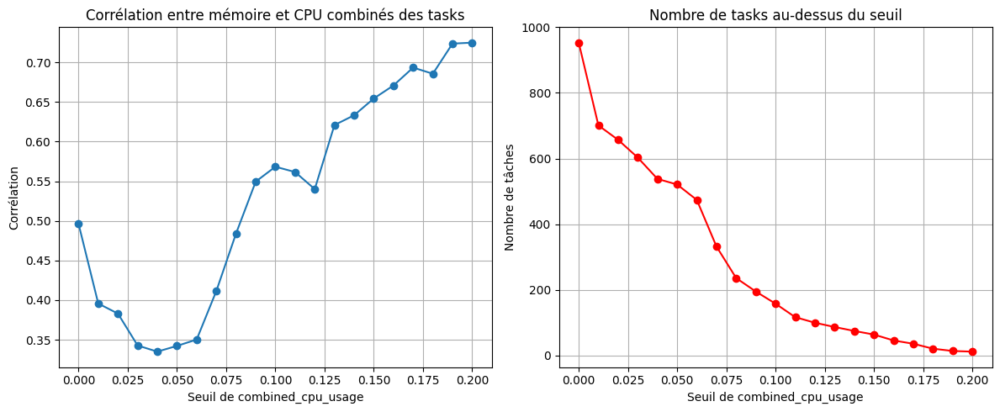
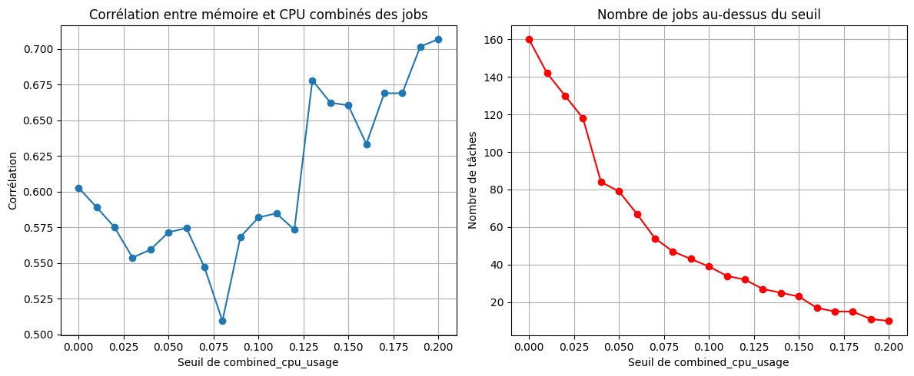
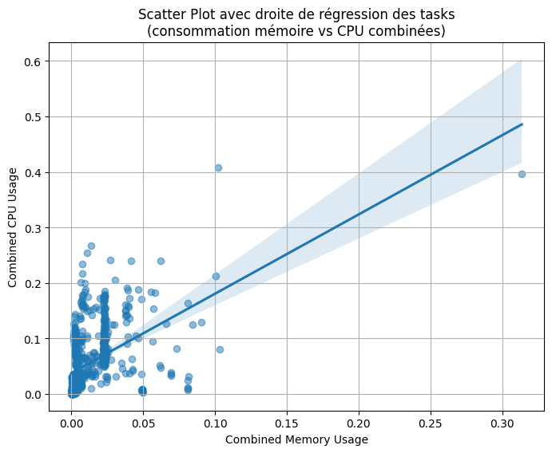
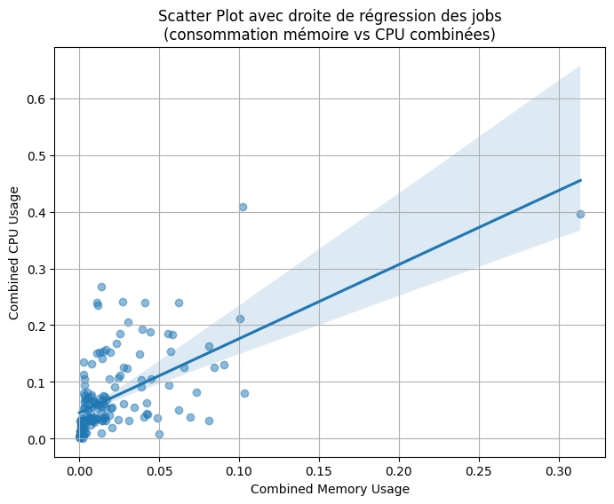
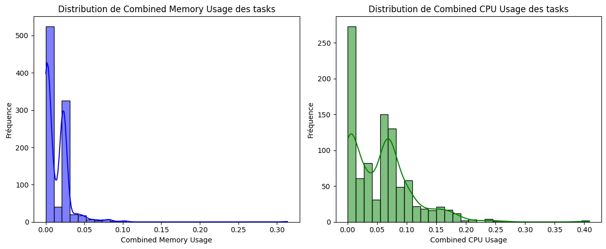
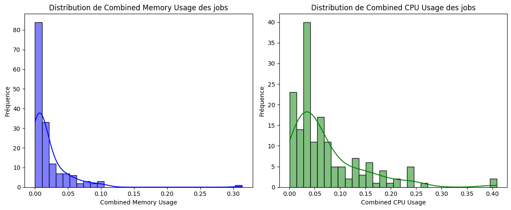
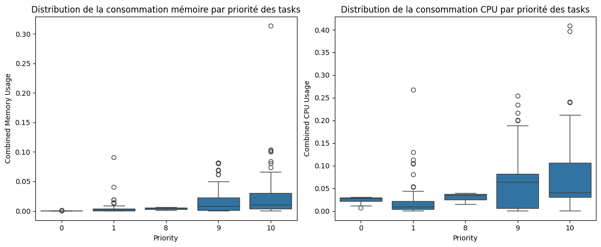
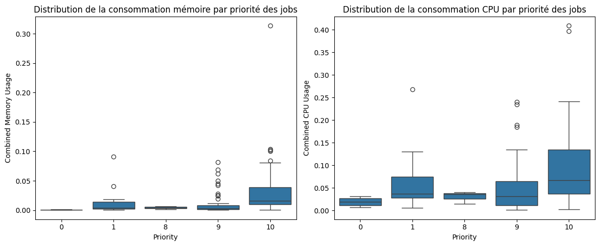
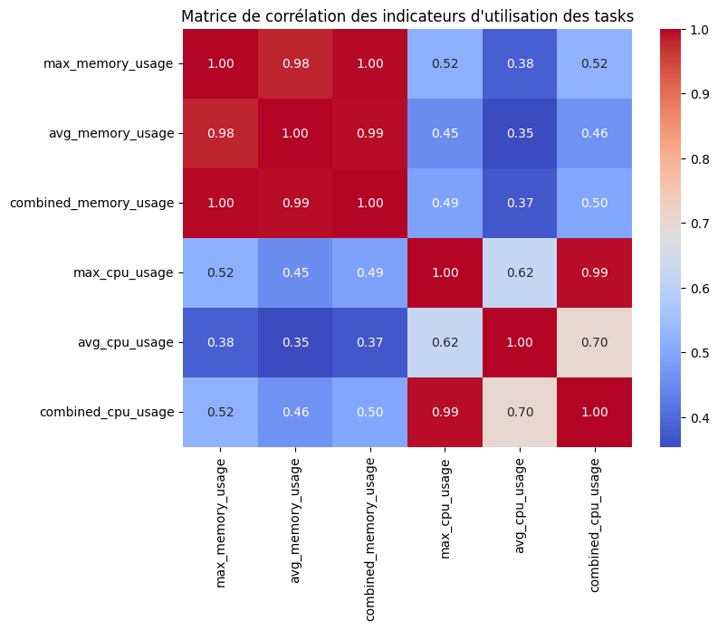
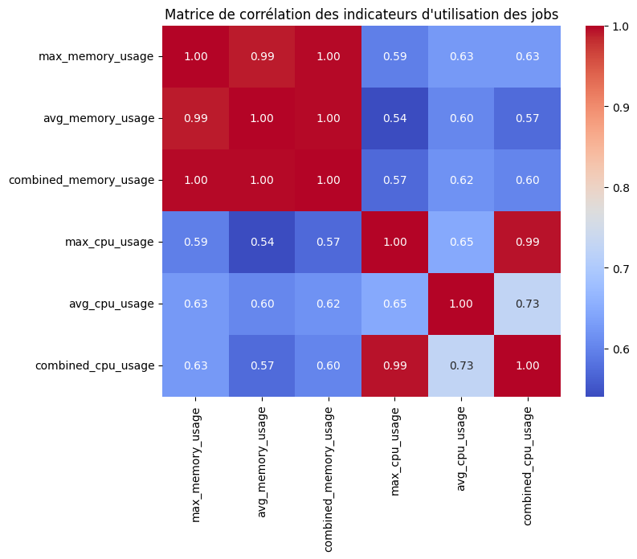

# Analyse des Traces Google Cluster sur le Supercalculateur Finisterrae III

## Contexte du Projet

Ce projet a pour objectif d’analyser les traces de Google Cluster datant de 2014, un ensemble de données fournissant des informations sur l'utilisation des ressources CPU et mémoire dans un environnement de calcul distribué. L'objectif est de comprendre les modèles d'utilisation des tâches, d'identifier les jobs dominants et d'analyser la corrélation entre l’utilisation du CPU et de la mémoire.

Nous avons décidé d’exécuter cette analyse sur le supercalculateur Finisterrae III de l'Université de La Corogne, car il offre un espace de stockage LUSTRE permettant de manipuler efficacement de grandes quantités de données (~1 To). De plus, les capacités massivement parallèles du cluster sont parfaitement adaptées à ce type de projet nécessitant des calculs intensifs.

---

## Structure des Données

Les données proviennent des fichiers CSV compressés fournis par Google. Chaque fichier contient des informations détaillées sur :

- **task_usage.csv** : Consommation de CPU, mémoire, durée des tâches.
- **task_events.csv** : Informations sur l’état des tâches, leur priorité, leur planification.

### Importation et Vérification des Données

Nous avons développé un script Python `importData.py` pour importer et nettoyer les fichiers CSV nécessaires à notre étude. Avant toute analyse, nous avons vérifié l'intégrité des données avec :

```bash
sha256sum --check SHA256SUM
```

Vérification réussie : tous les fichiers ont été correctement importés.

---

## Méthodologie de l’Analyse

L’analyse s’est déroulée en plusieurs étapes :

1. **Nettoyage des données** :

   - Suppression des valeurs nulles.
   - Filtrage des tâches dont la consommation CPU et mémoire est égale à zéro.
   - Ajout de colonnes dérivées comme la durée d’exécution des tâches.

2. **Calcul des métriques principales** :

   - **Consommation maximale et moyenne** du CPU et de la mémoire pour chaque tâche.
   - **Métrique combinée CPU et mémoire**, obtenue en prenant la moyenne des valeurs maximales et moyennes.

3. **Intégration des priorités des tâches** :

   - Jointure avec le fichier `task_events.csv` pour ajouter une information de priorité aux tâches.

4. **Identification des tâches dominantes** :

   - Classement des tâches selon leur consommation de ressources.
   - Identification des tâches les plus exigeantes en CPU et en mémoire.

5. **Analyse statistique et visualisation** :
   - **Distribution des ressources** à l’aide d’histogrammes.
   - **Corrélation entre CPU et mémoire** selon différents seuils.
   - **Impact des priorités sur la consommation des tâches**.
   - **Matrice de corrélation** pour comprendre les liens entre les variables.

---

## Principaux Résultats

### Répartition des Tâches par Priorité

L’analyse de la distribution des tâches en fonction de leur priorité révèle la répartition suivante :

| Priorité | Nombre de tâches |
| -------- | ---------------- |
| 0        | 15               |
| 1        | 83               |
| 8        | 3                |
| 9        | 718              |
| 10       | 134              |

La majorité des tâches et des jobs ont une **priorité élevée (9 et 10)**, ce qui suggère que **le cluster est principalement utilisé pour des jobs critiques nécessitant des ressources importantes**.

---

### Corrélation entre Consommation CPU et Mémoire

Pour mieux comprendre l’effet d’un seuil sur la consommation CPU, nous avons appliqué des filtres progressifs sur `combined_cpu_usage` et calculé la corrélation avec la mémoire.




#### Résultats :

- La **corrélation entre CPU et mémoire augmente avec la consommation CPU**.
- Pour les tâches les plus gourmandes en CPU (`combined_cpu_usage > 0.15`), la corrélation atteint **0.72**, ce qui signifie que ces tâches nécessitent aussi une mémoire importante.
- Pour les jobs les plus gourmands en CPU(`combined_cpu_usage > 0.125`), la correlation atteint 0.675, ce qui signifie que les jobs nécessitent à l'instar des tâches un mémoire importante.
- La plupart des tâches et des jobs ont une faible consommation CPU (< 0.05), mais celles avec une consommation élevée montrent une corrélation plus marquée.

---

### Visualisation des Données

#### **Scatter Plot : Relation CPU vs Mémoire**




Le **scatter plot** des tasks et des jobs montre une relation **croissante mais dispersée** entre `combined_memory_usage` et `combined_cpu_usage`. Cela indique que, bien que les tâches intensives en CPU tendent à consommer plus de mémoire, **la relation n’est pas strictement linéaire**.

---

#### **Distribution de la Consommation CPU et Mémoire**




L’analyse des distributions met en évidence une **asymétrie forte** :

- **La majorité des tâches et des jobs consomment très peu** de mémoire et de CPU.
- Une **minorité de tâches et de jobs dominantes** impacte fortement la consommation globale.

---

#### **Impact de la Priorité sur la Consommation**





Les **tâches à haute priorité (9 et 10) consomment plus de ressources** en moyenne, mais elles présentent **une forte variabilité**, ce qui suggère qu’un petit nombre de tâches critiques monopolise les ressources.  
Les **jobs à haute priorité (9 et 10) ainsi que les jobs de priorité 1 consomment plus de ressources**. De même que pour les tâches, ils présentent **une forte variabilité**, ce qui suggère qu’un petit nombre de tâches critiques monopolise les ressources.  
**70% des tasks de priorité 1 sont concentrés dans 3 jobs**.  

---

#### **Matrice de Corrélation des Indicateurs**




La **matrice de corrélation** met en évidence :

- Une **corrélation très forte (> 0.95) entre les métriques de mémoire** (max, moyenne, combinée).
- Une **corrélation élevée entre les indicateurs CPU**, notamment entre `max_cpu_usage` et `combined_cpu_usage` (0.99).
- Une **corrélation modérée (0.45 - 0.52) entre mémoire et CPU**, ce qui signifie que certaines tâches peuvent être gourmandes en CPU sans consommer autant de mémoire.  
Des résultats similaires sont observés pour les jobs.  
---

## Conclusion

L’analyse des traces Google Cluster nous a permis d’identifier plusieurs tendances clés :

- **Les tâches et les jobs les plus gourmandes** en CPU sont **également consommateurs de mémoire**, bien que la relation ne soit pas linéaire.
- **Les tâches et les jobs critiques (priorité 9 et 10)** présentent une **forte variabilité**, ce qui suggère que certaines consomment énormément de ressources tandis que d’autres sont plus légères.  
- **Les tâches de priorité 1 sont concentrés dans un faible nombre de jobs**.  
- **La distribution des ressources est inégale** : la majorité des tâches consomme peu, mais **quelques jobs dominants peuvent impacter les performances globales**.  

---

## Perspectives et Optimisations

- **Optimisation de l’allocation des ressources** : Identifier les tâches et les jobs les plus consommateurs et ajuster leur planification pour éviter les goulets d'étranglement.
- **Modélisation prédictive** : Utiliser l’apprentissage automatique pour anticiper la consommation des tâches et optimiser la répartition des ressources.
- **Affinement de la gestion des priorités** : Étudier plus en détail **l’impact des tâches critiques** pour améliorer leur exécution sans déséquilibrer l’utilisation du cluster.

Ce projet démontre **l’importance d’une analyse fine des traces d’utilisation** pour améliorer la gestion des supercalculateurs et optimiser l’allocation des ressources.
